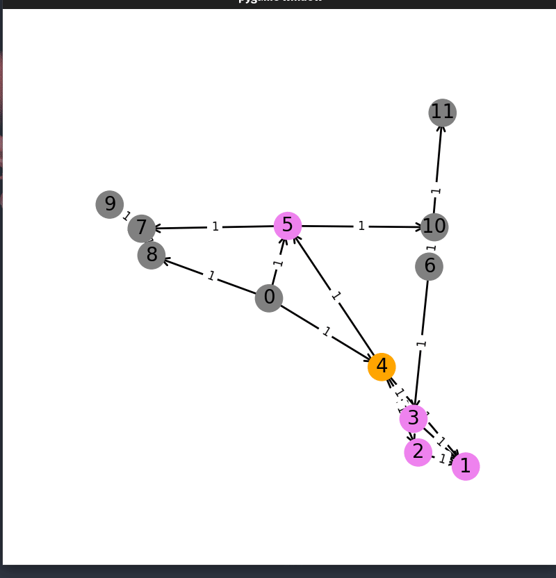
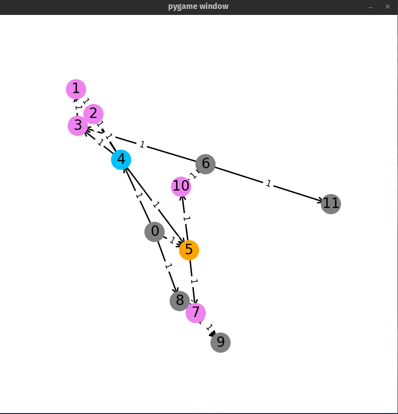

# Path Finding

## Excute

```shell
python main.py <input_file_path> <algorithm> <time_delay>(optional)
```
- Search_algorithm must be one of ['bfs', 'dfs', 'ucs', 'greedy', 'astar']

For example:

```shell
python3 main.py input/input.txt bfs
```

## Demo:

### BFS

<p align = "center">

</p>

### UCS

<p align = "center">

</p>
